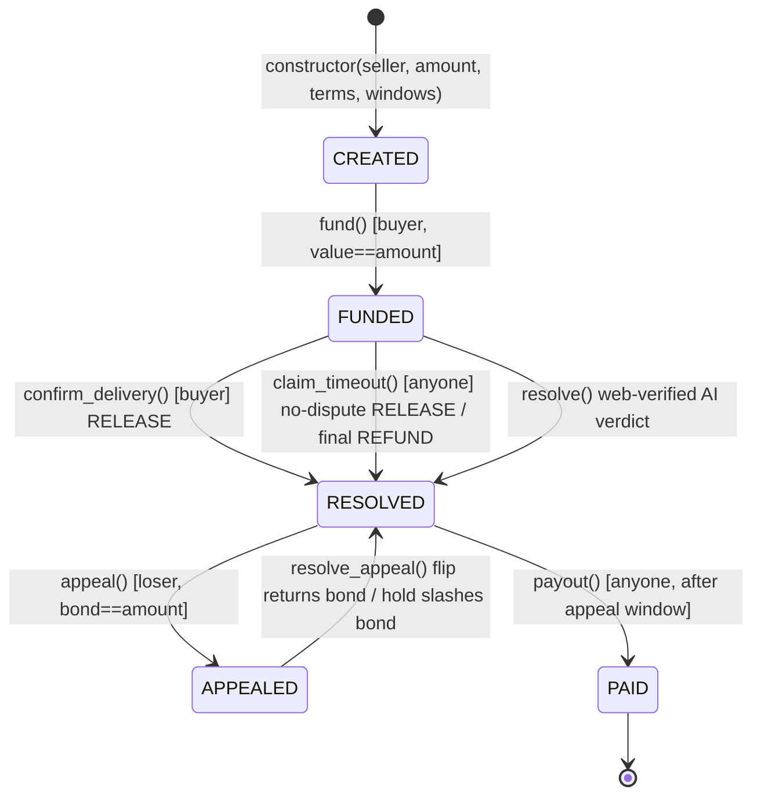
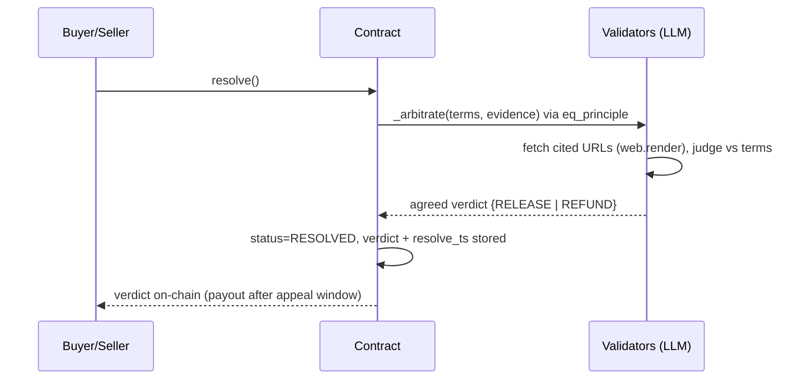

# Architecture - AIEscrowArbiter (v2.0)

A single-escrow native-GEN custody contract where every consensus-critical decision (evidence fetch, dispute verdict, appeal re-arbitration) is made inside the Intelligent Contract via the GenLayer Equivalence Principle. Source: `contracts/escrow_arbiter.py`. v1.0 is live on Bradbury at `0x829DB851bc9963c71B22305e3b73bf5B220D1462` (REFUND) and `0x679f4657d126Aa973A070E59654b6B8c37EaA7c0` (RELEASE); v2.0 supersedes them (deployment address recorded in CHANGELOG.md / README on redeploy).

## State machine

## State transitions

| From | Function | Guard | To |
|---|---|---|---|
| - | constructor(seller, amount_wei, terms, dispute_window_secs, final_window_secs, appeal_window_secs) | final_window > dispute_window, appeal_window >= 0 | CREATED |
| CREATED | fund() payable | sender==buyer, value==amount_wei, not already funded | FUNDED (deadlines armed) |
| FUNDED | submit_evidence(content, url) | sender in {buyer, seller}, url empty or http(s), before final deadline | FUNDED (append-only) |
| FUNDED | confirm_delivery() | sender==buyer | RESOLVED (RELEASE) |
| FUNDED | claim_timeout() | past dispute deadline (RELEASE) or past final deadline (REFUND) | RESOLVED |
| FUNDED | resolve() | status funded | RESOLVED (AI verdict) |
| RESOLVED | appeal() payable | sender is the losing party, value==amount_wei, not already appealed | APPEALED |
| APPEALED | resolve_appeal() | status appealed | RESOLVED (flip/hold) |
| RESOLVED | payout() | after the appeal window, not already paid | PAID |

`claim_timeout()` and `payout()` are permissionless, so no staked value can be locked by an inactive party or owner. Timers use the transaction datetime (`_chain_now()` from `gl.message_raw["datetime"]`), since GenLayer transaction context exposes no block number/height.

## Verdict engine (`_arbitrate`)

Non-deterministic reasoning collapsed to a deterministic on-chain verdict:

1. **Evidence assembly:** buyer/seller evidence items (content + optional URL) are concatenated as clearly-labeled untrusted data.
2. **Source fetch:** each cited http(s) URL is fetched inside consensus via `gl.nondet.web.render`, so the arbiter rules on the live source, not a party's paraphrase.
3. **Judgement:** an LLM weighs the fetched sources and evidence against the escrow `terms` and returns a strict JSON verdict (RELEASE to seller or REFUND to buyer).
4. **Fail-safe:** unparseable or empty output defaults to REFUND (buyer-protective).
5. **Consensus:** the leader's verdict is re-run and compared by validators under `gl.eq_principle`; they must agree on the discrete verdict, not on wording, so independent LLM runs converge.

## Appeal economics

| Actor | Locks | If the verdict flips | If the verdict holds |
|---|---|---|---|
| Appellant (loser) | bond == amount at `appeal()` | bond returned; the new verdict stands | bond slashed to the winner |

One appeal maximum; `payout()` stays locked until the appeal window closes, so a verdict is always contestable before funds move.

## Access control

| Function | Caller |
|---|---|
| constructor, get_state, get_status, get_evidence | any / views |
| fund, confirm_delivery | buyer only |
| submit_evidence | buyer or seller |
| resolve | any (while funded) |
| claim_timeout, payout | any (permissionless; guarded by deadlines / state) |
| appeal | the losing party only |
| resolve_appeal | any (while appealed) |

## Contract / frontend boundary

All consensus-critical logic - custody, deadlines, evidence fetch, verdict, appeal settlement, payout - lives in `contracts/escrow_arbiter.py`. `index.html` only reads state (`get_status`, `get_state`, `get_evidence`) and submits transactions; it never computes a verdict or moves funds. The trust boundary stays entirely on-chain.
